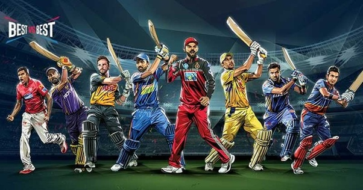
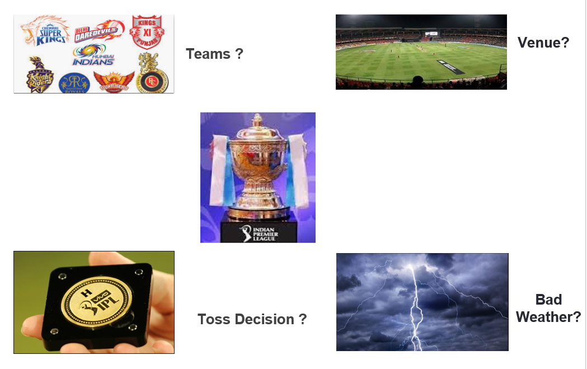

### IPL Analysis

The __Indian Premier League (IPL)__ is a professional Twenty20 cricket league founded by the Board of Control for Cricket in India (BCCI) in 2008 in India contested during March or April and May of every year by eight teams representing eight different cities in India. After 2 matches played by each team, there would be 2 Qualifiers and 1 Eliminator round, from which teams for the Final round is decided.Each team is owned by different owners and multiple stakeholders. Sometimes, this changes every year. This ownership takes players to the team through Auction.

## About the Data

| Column Name | Description |
| --- | --- |
| `ID` | ID of the Match |
| `SEASON` | IPL Season |
| `CITY`| City where the match was played |
| `DATE` | Date on which the match was played |
| `TEAM1` | First team of the match |
| `TEAM2` | Opposition Team of the match |
| `TOSS WINNER` | Team who won the Toss |
| `TOSS DECISION` | Toss Decision by the team who won the Toss (Field/Bat) |
| `RESULT` | Normal/Tie/No Result |
| `DL Applied` | Match Result was based on the DL Rule applied |
| `WINNER` | Team who won the match |
| `WIN BY RUNS` | By how many runs the team have won the match |
| `WIN BY WICKETS` | By how many wickets the team have won the match |
| `PLAYER OF MATCH` | Man of the Match |
| `VENUE` | Stadium on which the match was played |
| `UMPIRE1` | Details of the 1st Umpire |
| `UMPIRE2` | Details of the 2nd Umpire |
| `UMPIRE3` | Details of the 3rd Umpire |

## DATA ANALYSIS

Problem Statement : Factors that effects the result of a match

Wanted to know the insights? Click here !

[Jupyter Notebook](./Untitled1.ipynb)
